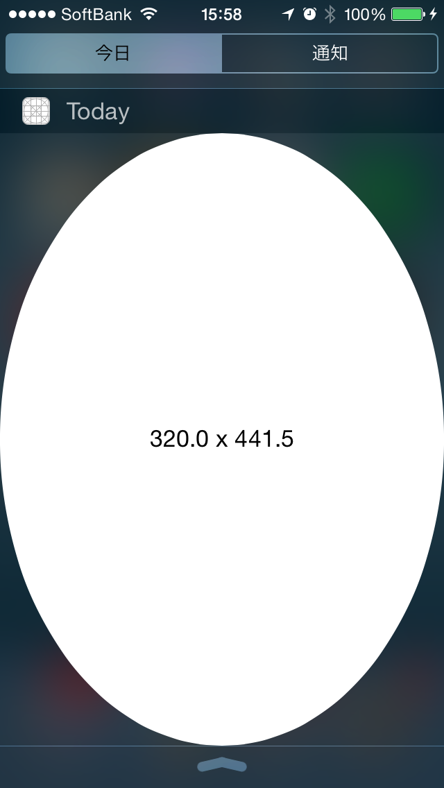
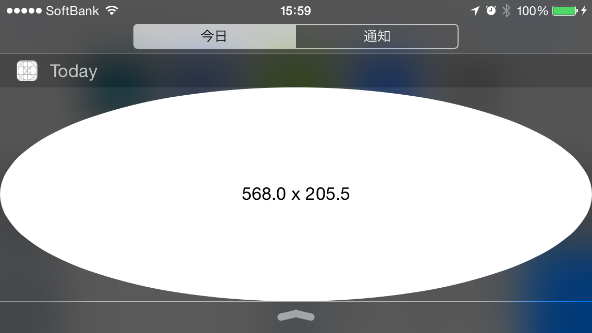

下記コードでToday Extensionの大きさはどうなるのか？
```Swift
override func viewDidLoad() {
    super.viewDidLoad()
    // Do any additional setup after loading the view from its nib.

    preferredContentSize = CGSize(width: 1024, height: 1024)
}

func widgetMarginInsetsForProposedMarginInsets(defaultMarginInsets: UIEdgeInsets) -> UIEdgeInsets {
    return UIEdgeInsetsZero
}
```
こうなった。



